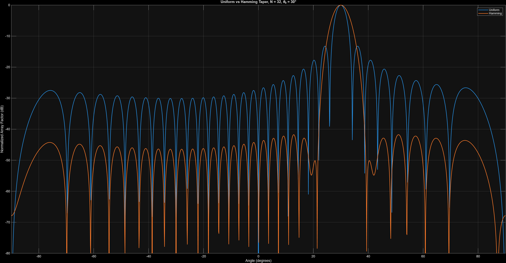

# Phased Array Signal Processing Platform

MATLAB-based simulation platform exploring phased-array antennas, beamforming, direction-of-arrival estimation, interference suppression, and satellite tracking concepts commonly used in satellite communications (SATCOM), radar systems, GNSS receivers, and aerospace applications.

---

## Overview

This project was developed to explore the fundamental principles behind modern electronically-steered antenna arrays.

The simulations demonstrate how antenna arrays can electronically steer beams, suppress interference, estimate signal directions, and track multiple targets without any mechanical movement.

The project progresses from basic Uniform Linear Array (ULA) beam steering to advanced adaptive beamforming and 2D planar array steering.

---

## Implemented Simulations

### 1. ULA Beam Steering

* Uniform Linear Array (ULA) beamforming
* Electronic steering toward arbitrary directions
* Effect of antenna count on beamwidth and directivity

**Key concepts:**

* Steering vectors
* Array factor
* Beamwidth
* Directivity

---

### 2. Element Spacing and Grating Lobes

Investigation of antenna spacing effects on array performance.

**Key concepts:**

* Spatial sampling
* Grating lobes
* Half-wavelength spacing
* Spatial aliasing

---

### 3. Uniform vs Hamming Tapering

Comparison between conventional uniform weighting and Hamming tapering.

**Key concepts:**

* Windowing
* Side-lobe suppression
* Main-lobe broadening
* Aperture weighting

---

### 4. Fixed Beam Jammer Suppression

Analysis of jammer attenuation as a function of arrival angle.

**Key concepts:**

* Spatial filtering
* Interference rejection
* Beam pattern analysis

---

### 5. Satellite Tracking Scenario

Simulation of an electronically steered beam following a moving satellite trajectory.

**Key concepts:**

* Dynamic beam steering
* Target tracking
* Satellite communication links

---

### 6. MVDR Adaptive Beamforming

Implementation of Minimum Variance Distortionless Response (MVDR) beamforming.

**Key concepts:**

* Adaptive beamforming
* Covariance matrices
* Interference nulling
* Signal preservation

---

### 7. MUSIC Direction-of-Arrival Estimation

Implementation of the MUSIC algorithm for high-resolution angle estimation.

**Key concepts:**

* Eigenvalue decomposition
* Signal and noise subspaces
* Direction-of-arrival estimation
* Super-resolution techniques

---

### 8. Multi-Target Tracking

Simulation of multiple simultaneous beams tracking independent moving targets.

**Key concepts:**

* Multi-beam operation
* Target isolation
* Cross-gain analysis
* Angular separation limits

---

### 9. 2D Planar Array Beamforming

Extension from linear arrays to planar antenna arrays.

**Key concepts:**

* Azimuth steering
* Elevation steering
* 2D beamforming
* Electronically steered arrays

---

## Example Results

### 2D Planar Array Beamforming

The array electronically steers a beam toward a desired azimuth and elevation direction.

---

### 2D Beam Pattern Heatmap

Visualization of antenna gain across the sky in azimuth and elevation.

---

### MVDR Adaptive Beamforming

Adaptive beamformer creating a deep null toward a jammer while preserving the desired signal.

---

### Uniform vs Hamming Tapering

Comparison of side-lobe suppression using Hamming weighting.

---

### Jammer Suppression

Performance of conventional beamforming against interference arriving from different angles.

---

### Multi-Target Tracking

Tracking multiple targets and evaluating beam isolation.

### Beam Steering Performance

Demonstrates beam narrowing as the number of antenna elements increases.

### Hamming Tapering

Reduction of side-lobe levels at the cost of a wider main beam.

### MVDR Adaptive Beamforming

Automatic placement of deep nulls in the direction of interference while maintaining gain toward the desired signal.

### Multi-Target Tracking

Analysis of target gain and cross-gain as multiple targets approach and separate.

### 2D Planar Array Beamforming

Visualization of beam steering in both azimuth and elevation dimensions.

---

## Aerospace Applications

The techniques implemented in this project are directly applicable to:

* Satellite communication terminals
* Electronically steered antennas
* Phased-array radar systems
* GNSS receivers
* Direction finding systems
* Spacecraft communication systems
* Electronic warfare systems
* Aerospace RF payloads

---

## Technologies

* MATLAB
* Digital Signal Processing (DSP)
* Array Signal Processing
* Linear Algebra
* RF Systems
* Beamforming
* Adaptive Filtering
* Statistical Signal Processing

---

## Future Work

Planned extensions include:

* 2D satellite tracking
* 2D adaptive beamforming
* Multiple moving satellites
* Moving jammer suppression
* Satellite link budget simulation
* GNSS receiver signal processing
* FPGA implementation of beamforming algorithms

---

## Author

**Zacharie El Hachemi**

Electrical Engineering – Polytechnique Montréal

Interests: RF Systems, Satellite Communications, Embedded Systems, FPGA Design, Signal Processing, and Aerospace Engineering.
